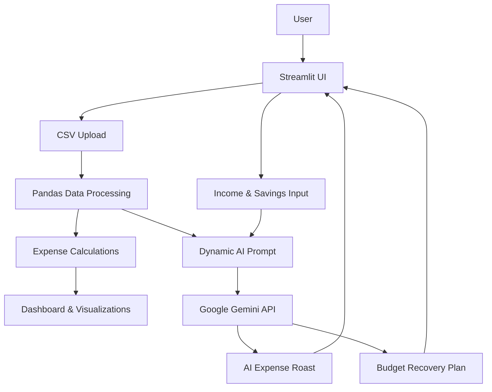

# 💰 Expense Roaster AI

> **AI-Powered Personal Expense Analytics & Budget Recovery Assistant**

Expense Roaster AI is an intelligent Streamlit-based financial analytics application that analyzes a user's monthly expense data and uses **Google Gemini AI** to identify spending patterns, roast unnecessary expenses, and generate a personalized budget recovery plan.

The project combines **Python, Pandas, Plotly, Streamlit, and Gemini AI** to transform raw expense data into actionable financial insights.

---

## 🚀 Live Application

**Live Demo:** `ADD_YOUR_STREAMLIT_APP_URL_HERE`

**GitHub Repository:** `ADD_YOUR_GITHUB_REPOSITORY_URL_HERE`

---

## 🎯 Project Objective

The objective of Expense Roaster AI is to help users understand their spending behavior through an interactive dashboard and AI-powered financial analysis.

Users can upload a monthly expense CSV, visualize their spending patterns, receive an AI-generated spending roast, and create a personalized budget recovery strategy based on their income and savings goals.

---

## ✨ Key Features

### 📊 Expense Dashboard

* Upload monthly expense data using CSV
* Automatic data validation and cleaning
* Calculate total spending
* Calculate average expense
* Identify highest expense
* Count total transactions
* View complete expense records

### 📈 Data Visualization

* Spending by category
* Expense distribution
* Daily spending trend
* Interactive Plotly charts
* KPI cards for important financial metrics

### 🤖 AI Expense Analysis

Gemini AI analyzes the uploaded expense data and provides:

* Spending behavior analysis
* Biggest spending problems
* Unnecessary expense identification
* Personalized recommendations
* Humorous spending roast
* Actionable improvement suggestions

### 💡 AI Budget Recovery Plan

Users can enter:

* Monthly income
* Desired monthly savings

The AI then generates:

* Financial health assessment
* Spending reduction recommendations
* Suggested category limits
* Savings strategy
* Weekly spending strategy
* Immediate actions
* Motivational conclusion

---

## 🛠️ Technology Stack

| Technology                | Purpose                        |
| ------------------------- | ------------------------------ |
| Python                    | Core programming               |
| Streamlit                 | Web application and UI         |
| Pandas                    | Data processing and analysis   |
| Plotly                    | Interactive data visualization |
| Google Gemini API         | AI-powered analysis            |
| Git & GitHub              | Version control                |
| Streamlit Community Cloud | Deployment                     |

---

## 🏗️ System Architecture



---

## 🔄 Data Flow

```text
User
  ↓
Upload Expense CSV
  ↓
Pandas DataFrame
  ↓
Data Cleaning & Validation
  ↓
Expense Calculations
  ↓
KPI Cards + Interactive Charts
  ↓
Dynamic Prompt Generation
  ↓
Google Gemini AI
  ↓
AI Expense Analysis
  ↓
Budget Recovery Recommendations
```

---

## 📁 Project Structure

```text
Expense-Roaster-AI/
│
├── app.py
├── requirements.txt
├── README.md
├── .gitignore
│
├── data/
│   └── sample_expenses.csv
│
└── .streamlit/
    └── secrets.toml
```

> `secrets.toml` is used locally for the Gemini API key and should never be committed to GitHub.

---

## 📋 CSV Format

The current version expects the uploaded CSV to contain these columns:

```text
Date
Category
Description
Amount
Payment_Method
```

### Example

```csv
Date,Category,Description,Amount,Payment_Method
2026-08-01,Food,Lunch,250,UPI
2026-08-02,Transport,Metro,80,UPI
2026-08-03,Entertainment,Movie,450,Card
2026-08-04,Shopping,T-Shirt,799,Card
2026-08-05,Food,Restaurant,650,UPI
```

---

## ⚙️ Installation & Setup

### 1. Clone the repository

```bash
git clone YOUR_GITHUB_REPOSITORY_URL
```

### 2. Open the project

```bash
cd Expense-Roaster-AI
```

### 3. Create a virtual environment

```bash
python -m venv venv
```

### 4. Activate the virtual environment

**Windows:**

```bash
venv\Scripts\activate
```

### 5. Install dependencies

```bash
pip install -r requirements.txt
```

### 6. Configure Gemini API

Create:

```text
.streamlit/secrets.toml
```

Add:

```toml
GEMINI_API_KEY = "YOUR_GEMINI_API_KEY"
```

Never expose your API key in source code or commit it to GitHub.

### 7. Run the application

```bash
streamlit run app.py
```

The application will open in your browser.

---

## 🧠 AI Prompt Engineering

Expense Roaster AI does not use Gemini as a generic chatbot.

The application dynamically provides Gemini with:

* Total spending
* Highest spending category
* Category-wise spending
* Individual expense records
* Monthly income
* Desired savings
* Remaining available money

The prompt instructs Gemini to analyze the actual financial data and generate practical recommendations rather than generic financial advice.

---

## 📊 Dashboard Metrics

The application calculates important financial KPIs including:

```text
Total Spending
Average Expense
Highest Expense
Number of Transactions
```

Category-level aggregation is performed using Pandas before being passed to the visualization and AI layers.

---

## 🔐 Security

The project uses Streamlit Secrets to protect the Gemini API key.

Sensitive files such as:

```text
.streamlit/secrets.toml
.env
```

are excluded using `.gitignore`.

API credentials should never be hard-coded into `app.py` or uploaded to GitHub.

---

## 🚀 Deployment

The application can be deployed using **Streamlit Community Cloud**.

Deployment steps:

1. Push the project to GitHub.
2. Open Streamlit Community Cloud.
3. Select the GitHub repository.
4. Select `app.py`.
5. Add `GEMINI_API_KEY` under application secrets.
6. Deploy the application.
7. Test the live application.

After deployment, update the **Live Application** section at the top of this README with the deployed URL.

---

## 🧪 Testing

The application should be tested for:

* Valid CSV upload
* Invalid CSV structure
* Missing values
* Numeric expense values
* Empty datasets
* Gemini API responses
* AI analysis
* Budget calculations
* Visualization rendering
* Deployment environment
* API key security

---

## 🔮 Future Improvements

Possible future improvements include:

* Support for multiple CSV formats
* Automatic column detection
* Monthly comparison
* Expense forecasting
* Savings progress tracking
* PDF financial reports
* Downloadable AI budget plans
* Voice-based financial assistant
* Gemini Vision integration for receipt analysis
* Authentication and personal accounts

---

## 📚 Capstone Alignment

This project demonstrates:

* Streamlit UI development
* Python programming
* Pandas data processing
* Data visualization
* Gemini AI integration
* Prompt engineering
* Dynamic context generation
* Session state management
* Form-based user input
* Git/GitHub version control
* Cloud deployment
* System architecture

The project was developed as part of the **MirAI School of Technology B.Tech Streamlit & AI Capstone**.

---

## 👨‍💻 Author

**Avi Kumar**

B.Tech Student
Python | Data Analytics | AI | Streamlit | SQL

---

## ⭐ Acknowledgement

Developed as part of the **MirAI School of Technology Virtual Summer Internship 2026 — AI Builder Track**.

If you found this project useful, consider giving the repository a ⭐.
